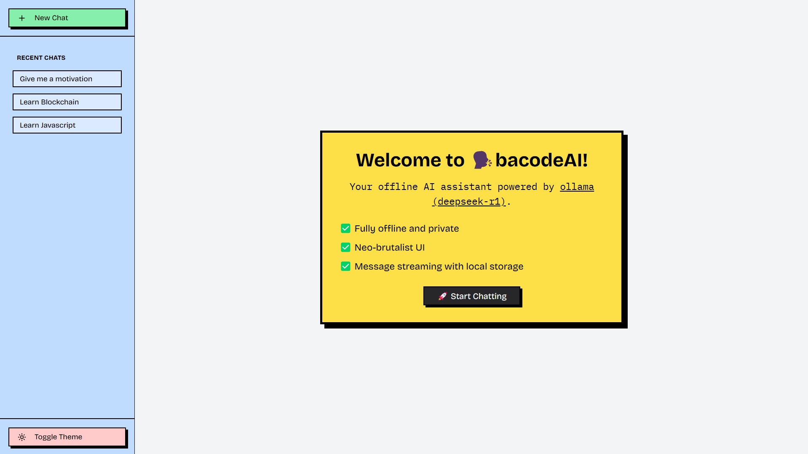
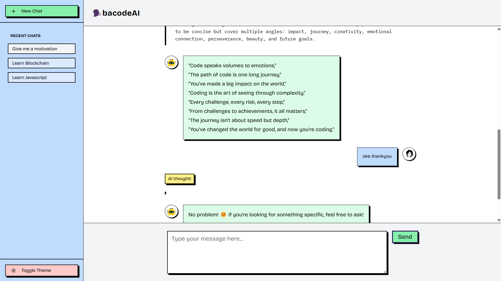

# 🗣️ Bacode AI (Chat Local AI)

A fully offline, streaming-capable AI chat UI powered by **Ollama Deepseek-r1 (1.5B parameters)**, built with **React (Vite)**, **TypeScript**, and styled using **Tailwind CSS + ShadCN**.

> Lightweight, private-first AI chat experience — with no external APIs or network dependency.


---

## 📸 Preview

- Onboarding

  

- Chat

  

---

## 🚀 Features

- 🔍 **Deepseek AI (Ollama 1.5B)** — lightweight and efficient LLM.
- 💬 **Streaming Chat UI** — real-time message updates and AI response streaming.
- 💭 **Streamed Thinking Process** — shows the model's reasoning steps as they happen.
- 📦 **Fully Offline** — no internet connection required after initial model load.
- 🧠 **Local Message Storage** — using IndexedDB via **Dixie JS** for persistent conversations.
- 🎨 **Modern UI** — clean interface powered by Tailwind CSS and ShadCN components.

---

## 📦 Tech Stack

| Layer     | Tech Stack                |
| --------- | ------------------------- |
| Frontend  | React (Vite) + TypeScript |
| Styling   | Tailwind CSS + ShadCN     |
| Storage   | IndexedDB + Dixie.js      |
| AI Engine | Ollama Deepseek-r1 (1.5B) |

---

## 🛠️ Installation

### Prerequisites

- [Node.js](https://nodejs.org/) (v18 or later)
- [Ollama](https://ollama.com/) installed locally

### 1. Clone the repo

```bash
git clone https://github.com/xsohe/bacode-ai.git
cd bacode-ai
```

### 2. Clone the repo

```bash
npm install
# or
yarn install
```

### 3. Start The App

```bash
npm run dev
# or
yarn dev
```

### 4. Download the model deepseek-r1

```bash
visit: https://ollama.com/library/deepseek-r1
```

### 5. Check and Run the model in terminal after download/install

```bash
ollama run deepseek-r1:1.5b
# or
ollama run deepseek-r1:7b
```

## 🧠 How it Works

- Chat UI sends prompts to local Ollama runtime.
- Ollama streams tokens in real-time.
- The UI displays both thinking process and final message.
- Conversations are saved in the browser using IndexedDB (via Dixie.js).
